# Architecture Diagrams

This document provides visual diagrams of the real-time event listener system architecture.

## System Overview

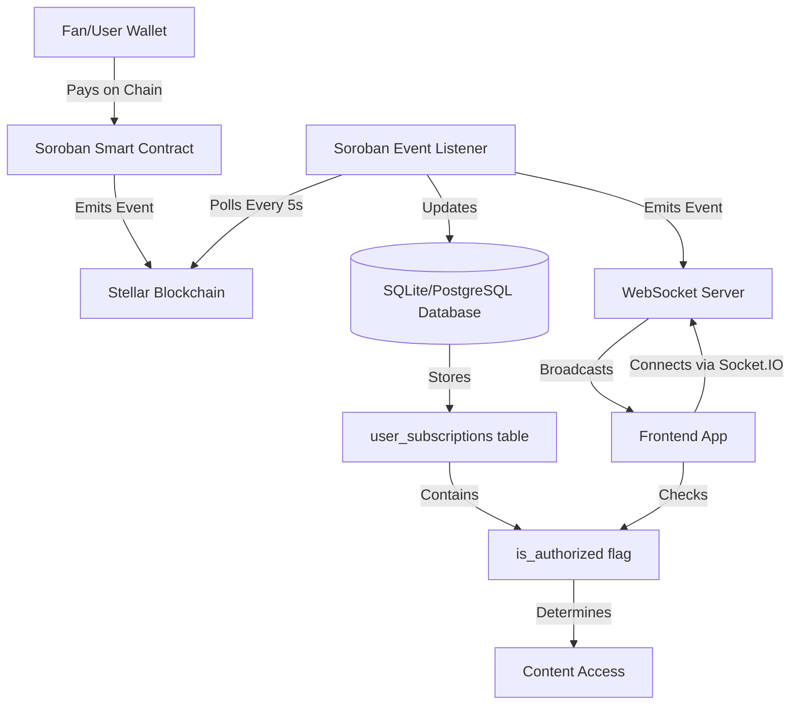

## Event Flow Sequence

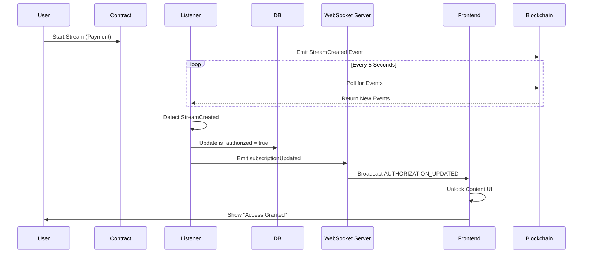

## Component Architecture

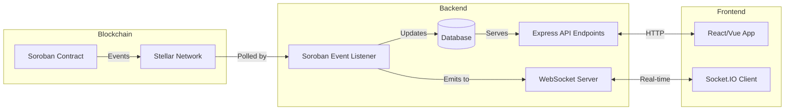

## Database Schema

```mermaid
erDiagram
    user_subscriptions {
        text id PK
        text user_address FK
        text creator_address FK
        text content_id
        integer is_authorized
        text subscription_type
        text started_at
        text ended_at
        text created_at
        text updated_at
        integer last_synced_block
        text metadata_json
    }
    
    INDEXES {
        idx_user_subscriptions_unique "UNIQUE(user_address, creator_address, content_id)"
        idx_user_subscriptions_user "INDEX(user_address)"
        idx_user_subscriptions_creator "INDEX(creator_address)"
        idx_user_subscriptions_authorized "INDEX(is_authorized)"
    }
```

## WebSocket Room Structure

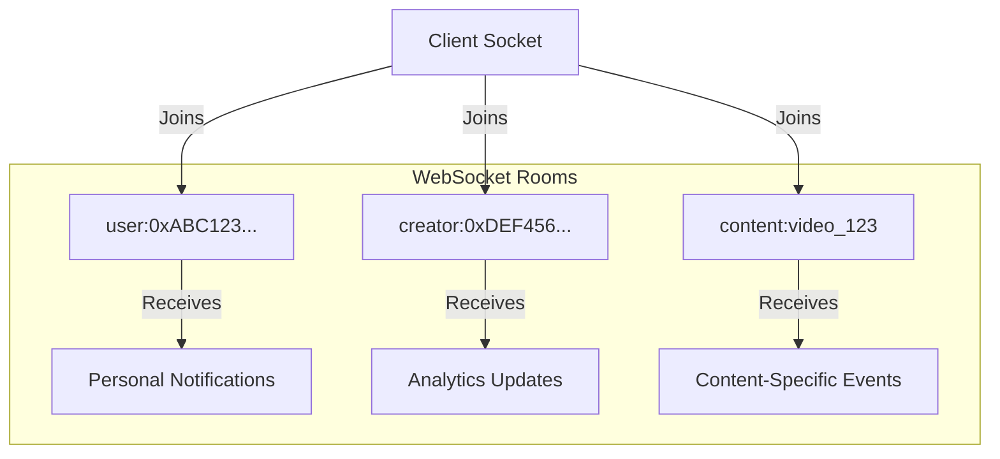

## Event Types Flow

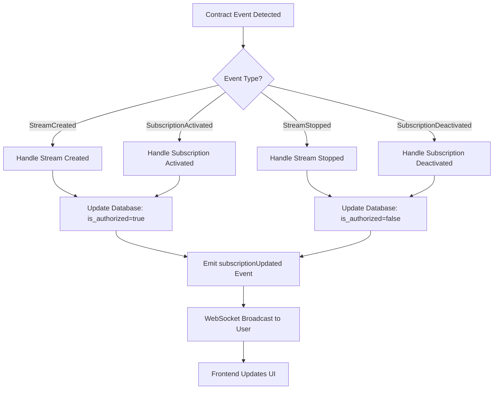

## API Endpoint Integration

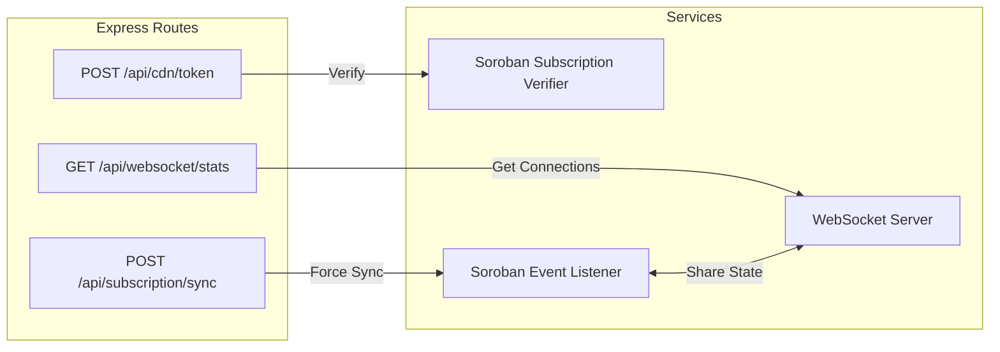

## Deployment Architecture (Production)

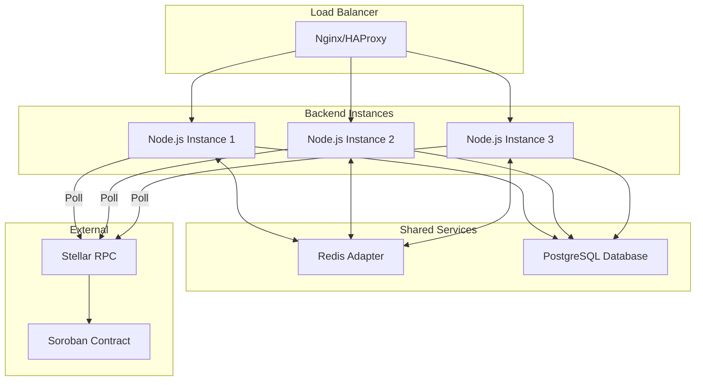

## Security Model

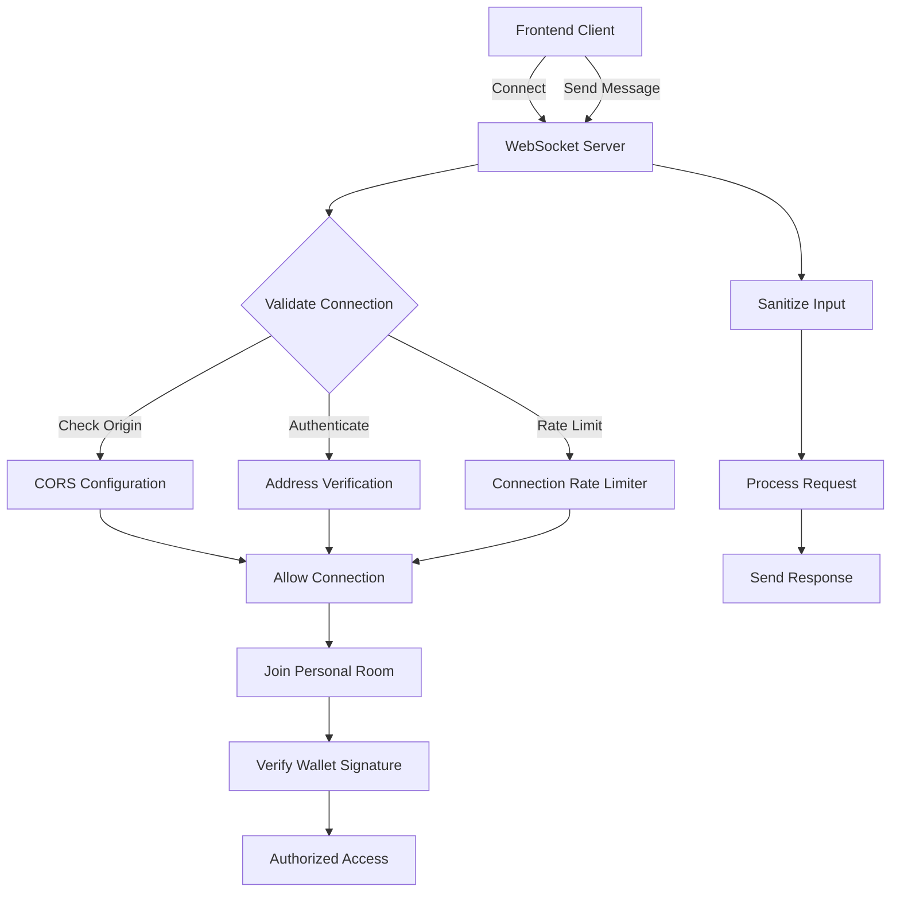

## Error Handling Flow

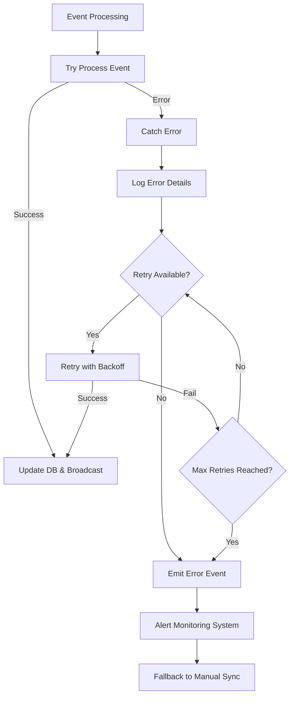

## Performance Optimization

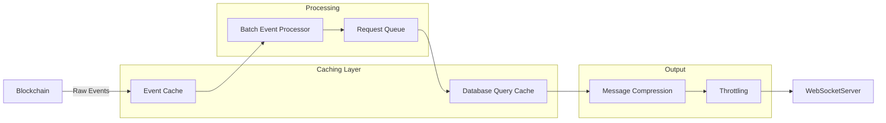

## Monitoring Points

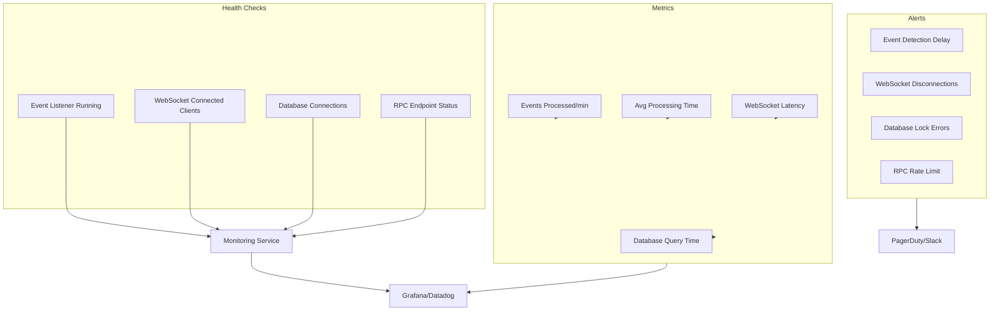

---

These diagrams illustrate the complete architecture of the real-time event listener system from multiple perspectives: component interaction, data flow, deployment topology, and operational concerns.
